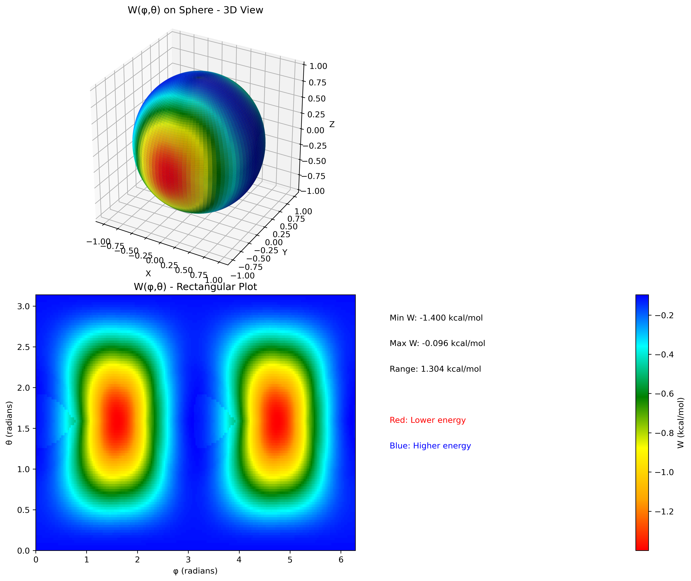

# Bell-BallMilling 

[](https://opensource.org/licenses/MIT)

This program evaluates the work term W(φ,θ) applied to a molecular geometry under external pressure. This calculation is a key component of the Bell model used to understand how external forces can modify reaction energy barriers, particularly in the context of mechanochemistry of ball-milling simulations.

The script reads two molecular geometries (i.e., a reactant minimum and a transition state), aligns them, and then calculates the work done by an external, directional pressure across a sphere of orientations.

## Features

- **File-based Inputs**: Geometries and simulation parameters are loaded from simple text files, not hard-coded.
- **Mass-Weighted Alignment**: Removes overall translation and rotation using mass-weighted center of mass and a Kabsch alignment algorithm.
- **Van der Waals Correction**: Optionally includes atomic van der Waals radii to define the effective molecular surface.
- **Comprehensive Output**: Generates a summary text file, a full data matrix of the work function, and a 3D spherical plot for easy visualization.
- **Python Standard Packaging**: Easily installable as a Python package via `pip`.

## Installation

This project uses modern Python packaging standards. The recommended way to install it is using `pip` in a virtual environment.

**Prerequisites:**
- Python 3.8 or newer
- `pip` and `venv`

### Installation Steps

1.  **Clone the repository:**
    ```bash
    git clone https://github.com/your-username/Bell_BallMilling.git
    cd Bell_BallMilling
    ```

2.  **Create and activate a virtual environment:**
    ```bash
    # For Unix/macOS
    python3 -m venv venv
    source venv/bin/activate

    # For Windows
    python -m venv venv
    .\venv\Scripts\activate
    ```

3.  **Install the package:**
    The project includes a `Bell_BallMilling.toml` file. For `pip` to recognize it as a standard project definition file, it should be named `pyproject.toml`.

    **Rename the file:**
    ```bash
    # For Unix/macOS
    mv Bell_BallMilling.toml pyproject.toml

    # For Windows
    ren Bell_BallMilling.toml pyproject.toml
    ```

    Now, run the installation with `pip`. This command reads the `pyproject.toml` file and automatically installs all required dependencies (`numpy`, `scipy`, `matplotlib`).

    ```bash
    pip install .
    ```

This will install the project and its dependencies into your virtual environment.

## Usage

After installation, you can run the calculation script. The program expects three input files to be present in the directory from which you run it.

1.  **Prepare your input files.**
    An example set of files is provided in the `example_files/input_files/` directory. Copy them to the root directory of the project to run a test case:

    ```bash
    # For Unix/macOS
    cp example_files/input_files/* .

    # For Windows
    copy example_files\input_files\* .
    ```

    The required files are:
    - `R_min.txt` (Initial geometry)
    - `R_TS.txt` (Transition state geometry)
    - `input.txt` (Calculation parameters)

2.  **Run the script:**
    Execute the main Python script from the root directory of the project:
    ```bash
    python Bell_BallMilling.py
    ```

3.  **Check the results.**
    The script will generate three output files in the current directory:
    - `output.txt`: A summary of the input parameters and key results.
    - `W.mtx`: The complete work function data, with columns for `phi`, `theta`, and `W(phi,theta)`.
    - `W_spherical.png`: A visual representation of the work function mapped onto a sphere.

    You can compare your generated files with the reference outputs located in `example_files/output_files/`.

## File Formats

### Input Files

**`R_min.txt` / `R_TS.txt`**
-   **Line 1**: `N` (an integer representing the number of atoms).
-   **Lines 2 to N+1**: `Z x y z` (atomic number and Cartesian coordinates in Ångstroms), with each atom on a new line.
Use code with caution.
Markdown
3
8 0.000000 0.117300 -0.054400
1 -0.757200 -0.469200 -0.054400
1 0.757200 -0.469200 -0.054400
Generated code
**`input.txt`**
-   **Line 1**: External pressure `P_ext` in GPa (float).
-   **Line 2**: Grid resolution for the `θ` coordinate, `ntheta` (integer). The `φ` grid will be `2 * ntheta`.
-   **Line 3**: A string `YES` or `NO` to indicate whether to include van der Waals radii in the calculation of the molecular surface.
Use code with caution.
1.0
40
YES
Generated code
### Output Files

**`output.txt`**
A human-readable summary containing the number of atoms, pressure, sphere radius, forces, and the minimum and maximum values of the work term W.

**`W.mtx`**
A machine-readable matrix file containing the calculated work values. The format is:
- **Header Lines**: Comments and dimensions.
- **Data Lines**: `phi  theta  W(phi,theta)`
  - `phi`: from `0` to `2π`
  - `theta`: from `0` to `π`
  - `W`: Work term in kcal/mol

**`W_spherical.png`**
A PNG image containing a 3D spherical plot and a 2D rectangular plot of W(φ,θ). The color scale (Red to Blue) indicates the work value, where red corresponds to lower energy (stabilizing) and blue corresponds to higher energy (destabilizing).



## License

This project is licensed under the MIT License. See the [LICENSE](LICENSE) file for details.
